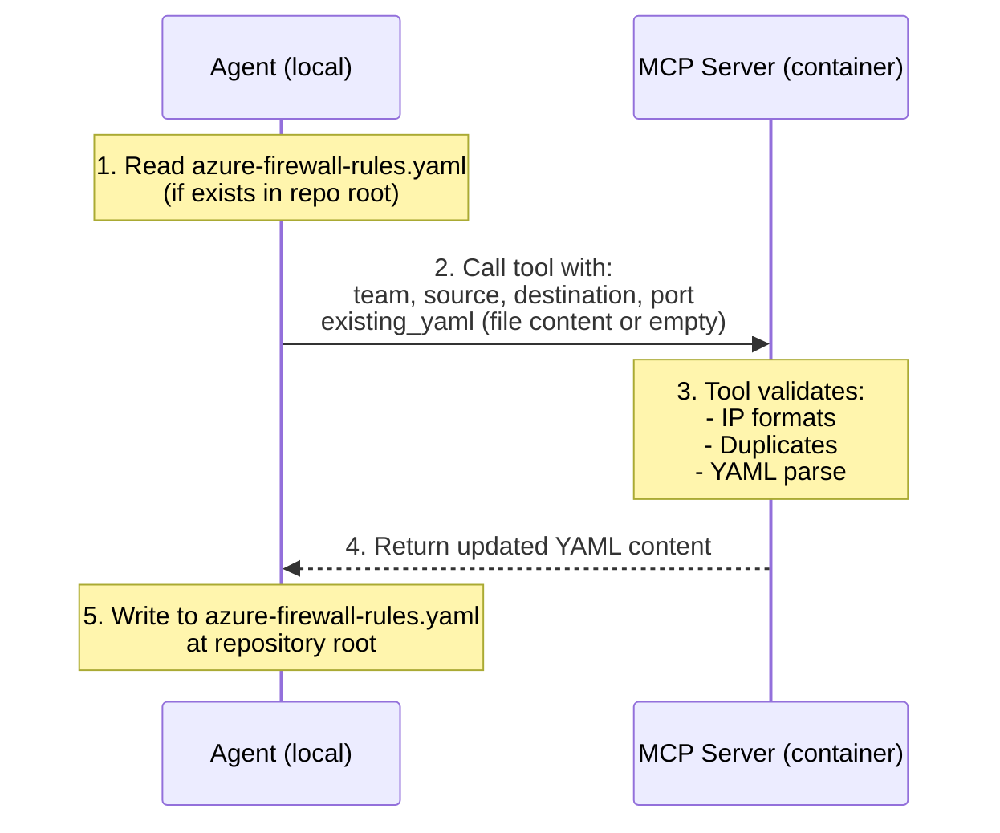

# Feature Specification: Azure Tools Group

**Feature Branch**: `002-azure-tools`  
**Created**: 2026-01-15  
**Updated**: 2026-01-16  
**Status**: Draft  
**Input**: User description: "I'd now like to add a tool to our mcp server. Please create a new spec for tools (it'll be a living document). The first tool we want is called 'new_azure_firewall_rules'..."

## Overview

This specification defines a **collection of Azure-related MCP tools**. Each tool in this group may have different implementation patterns depending on its purpose:

| Pattern | Description | Example Tools |
|---------|-------------|---------------|
| **Content-Return** | Tool processes data and returns content for agent to persist | `new_azure_firewall_rules` |
| **REST Passthrough** | Tool makes REST calls to Azure APIs and returns results | *(future tools)* |
| **Hybrid** | Tool combines local processing with remote API calls | *(future tools)* |

This is a **living document** - new tools will be added as sections below.

---

# Tool: `new_azure_firewall_rules`

## Architecture: Content-Return Pattern

This tool runs in a container and cannot directly write to the user's repository. It follows a **content-return pattern**:

### Why Content-Return?

- MCP server runs in an isolated container filesystem
- Agent has direct access to user's repository
- Keeps tool stateless and side-effect free
- Agent maintains control over file operations

### Repository Path Determination

The agent MUST determine the repository root before calling the tool:

1. **Single repository context**: Use the current working directory's git root
2. **Multi-repo workspace**: Agent MUST ask the user which repository to use
3. **Ambiguous context**: Agent MUST ask the user to specify the path

## User Scenarios & Testing

### User Story 1 - Create Initial Firewall Rules (Priority: P1)

As a Developer, I want to use the `new_azure_firewall_rules` tool to generate a configuration file so that I can document the first required firewall whitelist for my team.

**Why this priority**: Core functionality of the tool. Without the ability to create the initial file, the tool provides no value.

**Independent Test**: Can be tested by calling the tool with no `existing_yaml` and verifying the returned YAML contains the correct single entry. Agent then writes to `azure-firewall-rules.yaml` in the repository root.

**Acceptance Scenarios**:

1. **Given** no firewall rules file exists, **When** the tool is called with team "Platform", source "10.0.0.1", destination "13.0.0.1", and empty `existing_yaml`, **Then** the tool returns YAML content with a `rules` array containing one entry.
2. **Given** the agent receives YAML content, **When** the agent writes it to the repository root, **Then** a file named `azure-firewall-rules.yaml` exists with the correct content.

---

### User Story 2 - Append Rules to Existing Configuration (Priority: P2)

As a Developer, I want to add multiple whitelists to the same configuration file over time so that all my team's firewall requirements are centralized.

**Why this priority**: Essential for maintaining a growing set of rules as requested ("For each whitelist... it should be added to this one").

**Independent Test**: Can be tested by passing existing YAML content to the tool and verifying the returned YAML contains both old and new rules.

**Acceptance Scenarios**:

1. **Given** an existing `azure-firewall-rules.yaml` with 1 rule, **When** the agent reads the file, passes its content as `existing_yaml`, and calls the tool with new IPs, **Then** the tool returns YAML with 2 rules.
2. **Given** existing YAML content is passed, **When** the tool processes it, **Then** existing rules are preserved and not overwritten.

---

### User Story 3 - Input Validation (Priority: P2)

As a Security-conscious user, I want the tool to reject invalid IP addresses so that the generated configuration is always valid for downstream Azure provisioning.

**Why this priority**: Prevents the creation of broken infrastructure configurations.

**Independent Test**: Can be tested by providing malformed strings (e.g., "not-an-ip") and asserting the tool returns an error.

**Acceptance Scenarios**:

1. **Given** the tool is called, **When** the source IP is "999.999.999.999", **Then** the tool returns a validation error.
2. **Given** the tool is called, **When** the destination IP is missing or malformed, **Then** the tool returns a validation error.

---

### User Story 4 - Duplicate Rule Detection (Priority: P2)

As a Developer, I want the tool to detect and reject duplicate rules so that the configuration file stays clean and doesn't contain redundant entries.

**Why this priority**: Prevents configuration bloat and potential confusion during infrastructure provisioning.

**Independent Test**: Can be tested by passing existing YAML that already contains the exact rule being added.

**Acceptance Scenarios**:

1. **Given** existing YAML contains a rule for team "Platform" with source "10.0.0.1" and destination "13.0.0.1" on port 443, **When** the tool is called with the same parameters, **Then** the tool returns an informative message indicating the rule already exists.
2. **Given** a duplicate is detected, **When** the tool responds, **Then** it returns the existing YAML unchanged along with the duplicate notification.

---

### User Story 5 - Workspace Repository Selection (Priority: P1)

As a Developer working in a multi-repo workspace, I want the agent to ask me which repository to use when it cannot determine the correct one automatically.

**Why this priority**: Critical for correct file placement. Writing to the wrong repository would cause confusion and potential security issues.

**Independent Test**: Can be tested by simulating a multi-repo workspace and verifying the agent prompts for clarification.

**Acceptance Scenarios**:

1. **Given** the agent is operating in a multi-repo workspace, **When** the user requests a firewall rule, **Then** the agent asks the user to specify which repository should contain the `azure-firewall-rules.yaml` file.
2. **Given** the agent cannot determine the git root, **When** the user provides a path, **Then** the agent uses that path for file operations.

---

### Edge Cases

- **Malformed Existing YAML**: What happens if the `existing_yaml` content is not valid YAML? (Tool returns a parse error with details).
- **Empty Existing YAML**: What happens if `existing_yaml` is an empty string? (Tool treats it as no existing rules).
- **Missing Rules Key**: What happens if existing YAML exists but has no `rules` key? (Tool initializes `rules` array).
- **Duplicate Rules**: Tool detects exact duplicates (same team, source, destination, port) and returns unchanged YAML with notification.

## Requirements

### Functional Requirements

#### Tool Input/Output

- **FR-FW-001**: The system MUST implement an MCP tool named `new_azure_firewall_rules`.
- **FR-FW-002**: The tool MUST accept four parameters: `team` (required), `source` (required), `destination` (required), and `port` (optional, defaults to 443).
- **FR-FW-003**: The tool MUST accept an optional `existing_yaml` parameter containing the current content of the `azure-firewall-rules.yaml` file (empty string if file doesn't exist).
- **FR-FW-004**: The tool MUST NOT write to the filesystem. It MUST return the updated YAML content as a string in the tool response.
- **FR-FW-005**: The tool response MUST include a structured result containing:
  - `yaml_content`: The complete updated YAML as a string
  - `filename`: The **suggested** filename (e.g., `azure-firewall-rules.yaml`) for the Agent to use (Agent determines full path)
  - `action`: One of `created`, `updated`, or `duplicate_detected`
  - `message`: Human-readable description of what occurred

#### Validation

- **FR-FW-006**: The system MUST validate that `source` and `destination` are valid IPv4 or IPv6 addresses (or CIDR blocks).
- **FR-FW-007**: The tool MUST include `pattern` (Regex) validation in its `InputSchema` for `source` and `destination` to enable client-side validation by the agent before tool execution.
- **FR-FW-008**: If `existing_yaml` contains invalid YAML, the tool MUST return a descriptive parse error.

#### YAML Structure

- **FR-FW-009**: The YAML output MUST have a flat structure with a top-level `rules:` key containing an array of rule objects.
- **FR-FW-010**: Each rule object MUST include `team`, `source`, `destination`, and `port`.
- **FR-FW-011**: The system MUST default the port to `443` for all generated rules when not specified.

#### Duplicate Handling

- **FR-FW-012**: The tool MUST check for duplicate rules before adding a new entry.
- **FR-FW-013**: A duplicate is defined as a rule with identical `team`, `source`, `destination`, AND `port` values.
- **FR-FW-014**: When a duplicate is detected, the tool MUST return the existing YAML unchanged and set `action` to `duplicate_detected`.

#### Agent Responsibilities

- **FR-FW-015**: The tool description MUST instruct the agent to:
  1. Determine the repository root (ask user if ambiguous in multi-repo workspaces)
  2. Read existing `azure-firewall-rules.yaml` if it exists
  3. Pass the file content as `existing_yaml` parameter
  4. Write the returned `yaml_content` to `azure-firewall-rules.yaml` at the repository root
- **FR-FW-016**: The tool description MUST forbid the agent from guessing data from project structure and mandate asking the user for missing parameters.

#### Schema Resource

- **FR-FW-017**: The system MUST expose the Azure firewall rule validation logic as an MCP Resource named "Azure Firewall Rule Schema" (URI: `mcp://azure-firewall/schema`) in JSON Schema format.

### Key Entities

- **FirewallRule**: A data structure representing a single whitelist entry (team, source, destination, port).
- **FirewallConfig**: The YAML structure containing the `rules` array.
- **ToolResponse**: The structured response containing `yaml_content`, `filename` (suggestion), `action`, and `message`.

## Success Criteria

- **SC-FW-001**: The tool processes and returns YAML content in under 100ms.
- **SC-FW-002**: Generated YAML content passes standard YAML linter checks 100% of the time.
- **SC-FW-003**: All invalid IP address inputs are caught and rejected with a clear error message.
- **SC-FW-004**: The tool is successfully discovered by MCP clients via the `tools/list` capability.
- **SC-FW-005**: Duplicate rules are detected 100% of the time when exact matches exist.
- **SC-FW-006**: The agent correctly writes the returned YAML to the repository root after a successful tool call.
- **SC-FW-007**: In multi-repo workspaces, the agent asks the user for repository selection before proceeding.
- **SC-FW-008**: The agent uses the "Azure Firewall Rule Schema" MCP resource to validate inputs before execution.
- **SC-FW-009**: The agent correctly identifies when user input is required and prompts for clarification instead of guessing.

---

# Tool: *(Future Tool Placeholder)*

> **Note**: Additional Azure tools will be documented here as they are specified. Each tool section will include its own architecture pattern, user stories, requirements, and success criteria.

Example future tools:
- Azure Resource Group management (REST Passthrough pattern)
- Azure Key Vault secret retrieval (REST Passthrough pattern)
- Azure deployment status checks (REST Passthrough pattern)

---

# Group-Level Requirements

These requirements apply to ALL tools in the Azure Tools group.

## Shared Functional Requirements

- **FR-GRP-001**: All tools MUST be registered with the MCP server's tool registry.
- **FR-GRP-002**: All tools MUST be discoverable via the `tools/list` MCP capability.
- **FR-GRP-003**: All tools MUST use Zod schemas for input validation.
- **FR-GRP-004**: All tools MUST return structured responses with clear success/error indicators.
- **FR-GRP-005**: All tool descriptions MUST instruct agents to ask users for clarification rather than guessing values.

## Shared Success Criteria

- **SC-GRP-001**: All tools are discoverable via `tools/list`.
- **SC-GRP-002**: All tools return responses in under 5 seconds (network-dependent tools may have longer timeouts).
- **SC-GRP-003**: All tools provide clear, actionable error messages on failure.

---

# Assumptions

- The agent has file read/write capabilities in the user's local environment (for Content-Return pattern tools).
- The agent can determine or ask for the git repository root.
- For REST Passthrough tools, appropriate Azure credentials will be configured (details TBD per tool).
- YAML format follows standard YAML 1.2 specification.
